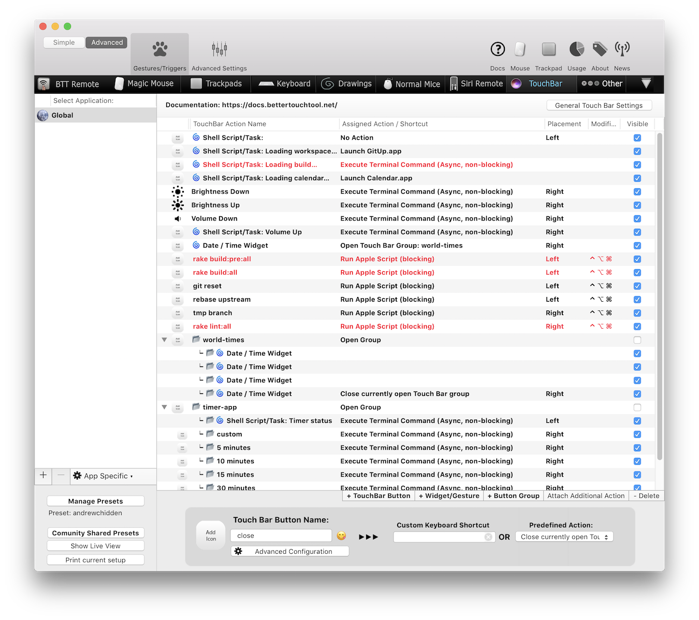
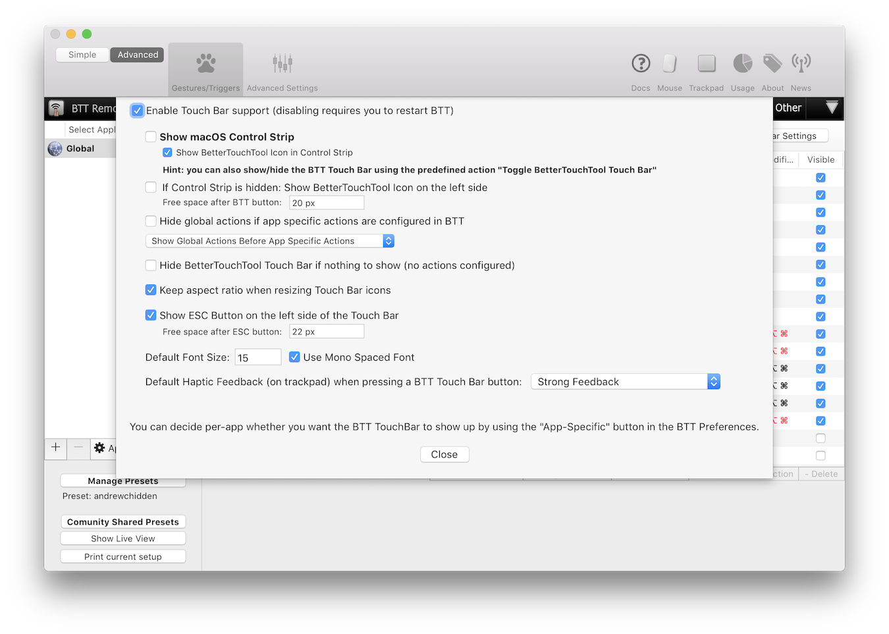

btt-presets
===========

A preset JSON configuration for BetterTouchTool. Provides view setup and action forwarding for various controller scripts.

Required controller scripts and compiled service binaries for the preset can be found at [andrewchidden/btt-controllers](https://github.com/andrewchidden/btt-controllers).

Article about the preset at [andrewchidden.com](https://andrewchidden.com/long-live-the-macbook-pro-with-touch-bar/).


*(The entries in red are private and not included in this repository.)*

## Installation

1. If not already installed, download and install [BetterTouchTool](https://folivora.ai/downloads).
	* **UPDATE (Aug 28): The preset was exported and tested using BTT v2.536 and may not work for the recently released BTT v2.6xx**. You can download `btt2.536.zip` here: [https://bettertouchtool.net/releases/](https://bettertouchtool.net/releases/)
2. Download the latest controller scripts and compiled service binaries for the preset: [andrewchidden/btt-controllers](https://github.com/andrewchidden/btt-controllers).
	* `git clone` the repository to have the path `~/bettertouchtool`.
	* Alternatively, download the zip archive, decompress, and move + rename as `~/bettertouchtool`.
3. Download a preset:
	* **andrewchidden-with-settings.bttpreset** if new to BetterTouchTool. Contains everything including BetterTouchTool settings to allow the preset to function as intended.
	* **andrewchidden.bttpreset** if already using BetterTouchTool. Only contains controls and triggers. You will need to manually configure parts of the preset and/or BTT after installation.
4. Open the preset (double-click) to import it into BetterTouchTool.
5. Configure the preset—please look at the next section for instructions. This is required for the preset to work!

## Configuration
For all steps, see the **environment variables::setting** section for help if needed.

1. Identify where you downloaded the controller scripts. Ideally they already have the path `~/bettertouchtool`.
	* If this is not the case, set the environment variable `BTT_USR_ROOT` to the controllers directory. 
2. Set the environment variables `BTT_WEBSERVER_URL` and `BTT_WEBSERVER_SHAREDSECRET` corresponding to the BetterTouchTool web server URL and shared secret. Can be found by enabling “Advanced” mode, opening “Advanced Settings,” and then navigating to the “Webserver” tab.
3. Set the environment variable `BTT_EVENTKIT_CALENDAR_NAMES` to a comma-delimited, case-sensitive list of calendar names that should be checked for upcoming events. 
4. Set the environment variable `BTT_GIT_WORKING_DIR` to the primary working directory for Git diff statistics and macro-triggered Git operations.
5. If necessary, modify the “General Touch Bar Settings” to match those below:



## Environment Variables

### Setting
To set some environment variable `<env_var>` to value `<value>`, modify (or create) the file `~/.bash_profile` to include the line `export <env_var>=<value>`.

### Documentation

**Required**

* `BTT_USR_ROOT` is the path to the user-facing folder containing preset scripts and configurations. Defaults to `~/bettertouchtool`.
* `BTT_WEBSERVER_URL` is the BetterTouchTool web server URL in the format `protocol://address:port`. If not specified, will default to `http://127.0.0.1:64875`. Be advised that HTTPS incurs some latency.
* `BTT_WEBSERVER_SHAREDSECRET` is the optional shared secret to authenticate pushes to the BetterTouchTool web server. Leave blank if not using a shared secret to authenticate pushes.

**User-Facing**

* `BTT_EVENTKIT_CALENDAR_NAMES` is the comma-delimited, case-sensitive list of calendar names to check for upcoming events. If not specified, all calendars are checked.
* `BTT_GIT_WORKING_DIR` is the working directory to use for macro-triggered Git operations and diff statistics. If not specified, Git commands will fail.

**System**

* `BTT_SYS_ROOT` is the path to the system folder used by services to save and share state. Defaults to `~/.btt`.

## Here be Dragons

* **Dragon:** Shell scripts run through BetterTouchTool do not receive environment variables regardless where the variable was specified and when BetterTouchTool was launched.
	* **Slayer:** Controller runners that require access to `BTT_` environment variables perform `source ~/.bash_profile` at the start.

## Contact

```
"andrew"
"@"
"andrewchidden.com"
```

## License

Copyright © 2018 CarbonTech Software LLC

Permission is hereby granted, free of charge, to any person obtaining a copy of this software and associated documentation files (the "Software"), to deal in the Software without restriction, including without limitation the rights to use, copy, modify, merge, publish, distribute, sublicense, and/or sell copies of the Software, and to permit persons to whom the Software is furnished to do so, subject to the following conditions:

The above copyright notice and this permission notice shall be included in all copies or substantial portions of the Software.

THE SOFTWARE IS PROVIDED "AS IS", WITHOUT WARRANTY OF ANY KIND, EXPRESS OR IMPLIED, INCLUDING BUT NOT LIMITED TO THE WARRANTIES OF MERCHANTABILITY, FITNESS FOR A PARTICULAR PURPOSE AND NONINFRINGEMENT. IN NO EVENT SHALL THE AUTHORS OR COPYRIGHT HOLDERS BE LIABLE FOR ANY CLAIM, DAMAGES OR OTHER LIABILITY, WHETHER IN AN ACTION OF CONTRACT, TORT OR OTHERWISE, ARISING FROM, OUT OF OR IN CONNECTION WITH THE SOFTWARE OR THE USE OR OTHER DEALINGS IN THE SOFTWARE.